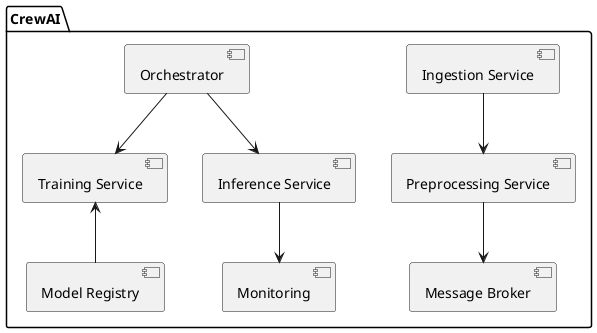

# 1. Introduzione e obiettivi del progetto

## 1.1 Contesto e ambito  
CrewAI nasce per semplificare lo sviluppo e la gestione di applicazioni AI basate su Large Language Models (LLM) in ambienti enterprise. Il framework copre l’intero ciclo di vita del modello, dalla raccolta e normalizzazione dei dati fino all’inferenza e al monitoring in produzione. Si integra con sistemi di orchestrazione container, message broker e servizi di cloud computing.

## 1.2 Obiettivi principali  
- Definire una pipeline modulare per ingestion, preprocessing, addestramento e inferenza di LLM  
- Garantire astrazione dei provider LLM (OpenAI, Azure, AWS, local) tramite adapter  
- Fornire strumenti per gestione di configurazioni, versioning modelli e roll-back  
- Includere meccanismi di logging, monitoraggio e alerting nativi  

## 1.3 Pubblico di riferimento  
- Data engineer e ML engineer che progettano pipeline di dati e modelli  
- Software architect interessati a pattern di integrazione con LLM  
- DevOps engineer responsabili di CI/CD e monitoraggio  

## 1.4 Metodologia di presentazione  
Ogni sezione unisce descrizione tecnica, diagrammi UML e snippet di codice. I concetti vengono introdotti partendo dalla visione ad alto livello per scendere poi nei dettagli implementativi e di configurazione.

---

# 2. Architettura tecnica e design patterns

## 2.1 Visione generale dell’architettura  
CrewAI è organizzato in microservizi:
- **Ingestion Service**: raccoglie dati da database, API esterne e file system  
- **Preprocessing Service**: normalizza, tokenizza e arricchisce i dati  
- **Training Service**: orchestri addestramenti sui cluster GPU/TPU  
- **Inference Service**: espone endpoint REST/GRPC per le chiamate ai modelli  
- **Orchestrator**: coordina workflow tramite message broker (ad es. Kafka)  
- **Monitoring & Logging**: aggrega metriche e log tramite Prometheus e ELK  

## 2.2 Pattern di design adottati  
- **Pipeline Pattern**: sequenza di step indipendenti per trasformazione dati  
- **Adapter Pattern**: astrazione dei provider LLM dietro interfaccia comune  
- **Factory Pattern**: istanzia componenti (tokenizer, evaluator) in base a configurazione  
- **Strategy Pattern**: scelta dinamica dell’algoritmo di tokenizzazione o di inferenza  

## 2.3 Motivazioni e trade-off  
- Modularità vs. latenza: ogni microservizio introduce overhead di rete  
- Flessibilità vs. complessità operativa: più servizi richiedono gestione di deployment  
- Provider-agnostic vs. ottimizzazione specialistica: astrazione riduce performance su SDK proprietari  

## 2.4 Requisiti non funzionali  
- **Scalabilità**: orizzontale tramite Kubernetes e autoscaling  
- **Affidabilità**: retry logic, circuit breaker e backup dei modelli  
- **Sicurezza**: autenticazione JWT, cifratura in transito/TLS e at-rest  
- **Osservabilità**: tracciamento distribuito e dashboard centralizzate  

---

# 3. Crew Diagram: componenti e flussi di dati

## 3.1 Diagramma dei componenti  


## 3.2 Flusso di dati end-to-end  
1. L’Ingestion Service legge dati grezzi e li pubblica su Kafka  
2. Il Preprocessing Service consuma, trasforma e archivia in object storage (S3)  
3. L’Orchestrator innesca job di addestramento con riferimenti al data lake  
4. Al termine, il modello viene registrato in Model Registry e distribuito all’Inference Service  
5. Client esterni effettuano chiamate via REST al punto di ingresso API Gateway  

## 3.3 Integrazione con sistemi esterni  
- Storage (S3, Azure Blob) tramite SDK nativo  
- Message broker (Kafka, RabbitMQ) con librerie open source  
- CI/CD (GitLab CI, Jenkins) per pipeline di build e deploy automatizzati  
- Security (Vault, KMS) per gestione segreti e chiavi  

## 3.4 Annotazioni e convenzioni UML  
- Componenti rappresentati come rettangoli con stereotipi  
- Flussi dati indicati con frecce etichettate dal formato di messaggio  
- Gruppi logici separati in package  

---

# 4. Esempi pratici e snippet di codice

## 4.1 Caso d’uso: pipeline di ingestione dati  
```python
from kafka import KafkaProducer
import json

producer = KafkaProducer(bootstrap_servers='kafka:9092',
                         value_serializer=lambda v: json.dumps(v).encode('utf-8'))

def ingest_record(record):
    producer.send('raw-data', record)
    producer.flush()
```

## 4.2 Caso d’uso: addestramento e inferenza LLM  
```python
from crewai.training import Trainer
from crewai.models import LLMAdapterFactory

# Configurazione Trainer
trainer = Trainer(
    adapter=LLMAdapterFactory.create('openai', api_key='***'),
    train_data_uri='s3://bucket/preprocessed/',
    output_model_uri='s3://bucket/models/model-v1'
)

trainer.run()
```

Esempio di inferenza REST:
```bash
curl -X POST http://inference.api/llm/predict \
  -H "Authorization: Bearer <token>" \
  -d '{"prompt":"Ciao, come stai?"}'
```

## 4.3 Best practices per il prompt engineering  
- Isolare contesto e istruzioni con delimitatori espliciti  
- Utilizzare esempi (few-shot learning) quando possibile  
- Controllare formato di output con JSON schema  

## 4.4 Gestione errori e logging  
```python
import logging
from retrying import retry

logger = logging.getLogger('crewai.ingestion')

@retry(stop_max_attempt_number=3, wait_fixed=2000)
def process_message(msg):
    try:
        # elaborazioni...
        pass
    except Exception as e:
        logger.error("Errore elaborazione %s: %s", msg.key, str(e))
        raise
```

---

# 5. Analisi critica e valutazione

## 5.1 Punti di forza  
- Architettura modulare e facilmente estendibile  
- Adattabilità a diversi provider LLM  
- Solide capacità di monitoraggio e retraining  

## 5.2 Limiti e gap  
- Overhead di latenza inter-service su microservizi  
- Complessità di gestione in ambienti on-premise non containerizzati  
- Dipendenza da SDK esterni per provider LLM  

## 5.3 Confronto con soluzioni concorrenti  
- LangChain: focus su prompt chaining, meno orientato a CI/CD enterprise  
- LlamaIndex: ottimo per indicizzazione, ma manca orchestrazione end-to-end  
- Hugging Face Infinity: scalabilità elevata, ma costi e lock-in cloud  

## 5.4 Metriche di performance  
- Throughput (richieste/s)  
- Latency P95/P99  
- Utilizzo GPU/CPU durante l’addestramento  
- Error rate e tempi di recovery  

---

# 6. Futuri sviluppi e raccomandazioni

## 6.1 Roadmap funzionalità  
- Supporto multimodale (audio, immagini)  
- Interfaccia grafica low-code per pipeline design  
- Plugin marketplace per algoritmi custom  

## 6.2 Miglioramenti architetturali  
- Consolidamento di alcuni microservizi per ridurre latenza  
- Introduzione di serverless functions per burst di inferenza  
- Ottimizzazione flusso di caching modelli  

## 6.3 Feedback loop e dati di telemetria  
- A/B testing dinamico e raccolta feedback utente  
- Telemetria distribuita con Jaeger/OpenTelemetry  
- Dashboard in real-time su Grafana  

## 6.4 Raccomandazioni operative  
- Automatizzare il versioning dei modelli su Git-like registry  
- Stabilire policy di retrollo a caldo (hot-swap) per deploy  
- Pianificare revisioni periodiche del Prompt Design Document  

---

Il report fornisce una panoramica tecnico-operativa di CrewAI, illustrandone i componenti, i pattern architetturali, casi d’uso pratici e linee guida per evoluzioni future nell’ambito delle applicazioni basate su LLM.